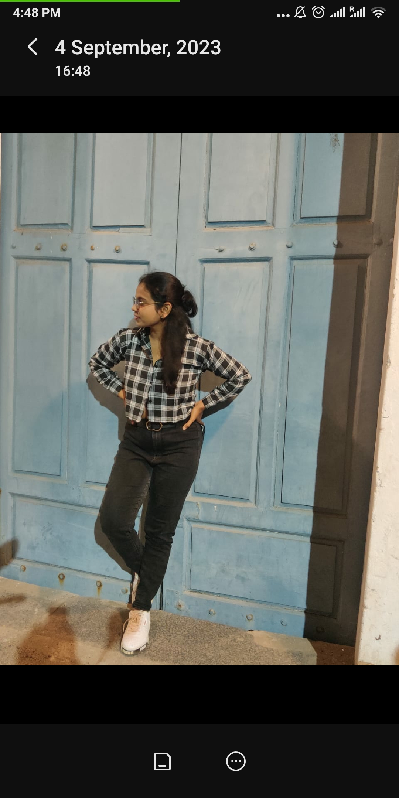

# Sugandhini

I'm a passionate explorer who loves to travel and immerse myself in different cultures. One of my most memorable adventures was backpacking through Southeast Asia, where I explored ancient temples in Cambodia, trekked through the lush jungles of Vietnam, and savored street food in Bangkok.

When I'm not traveling, you can find me engrossed in a good book. I'm an avid reader with a diverse taste, ranging from classic literature to science fiction. Reading allows me to escape into different worlds and gain new perspectives.

I'm also a hobbyist photographer, and I enjoy capturing the beauty of everyday moments. Whether it's a stunning sunset, a candid portrait, or the intricate details of nature, photography allows me to freeze time and share my perspective with others.

I believe in lifelong learning and am always seeking opportunities to acquire new skills. From coding to cooking, I'm not afraid to dive into new challenges and expand my horizons.

Feel free to connect with me to share travel stories, book recommendations, or discuss photography techniques. Let's embark on a journey of discovery together!

